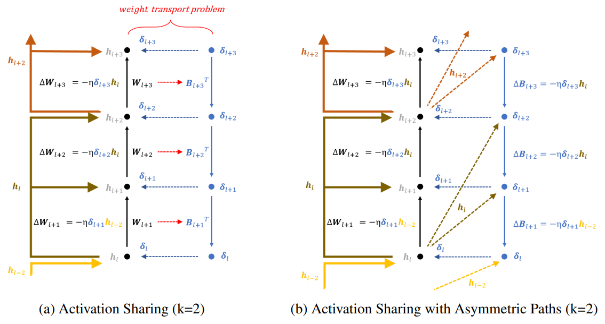

# Activation-Sharing-with-Asymmetric-Paths

This repository is the official implementation of Activation-Sharing-with-Asymmetric-Paths. 

+ The proposed biologically plausible algorithm supports training deep convolutional networks without the weight transport problem and bidirectional connections.
+ The proposed biologically plausible algorithm can significantly reduce memory access overhead when implemented in hardware.

<p align="center">

## Requirements

To install requirements:

```setup
conda env create -f environment_asap.yaml
conda activate asap
```

## Training

See help (--h flag) for available options before executing the code.

`train.py` is provided to train the model.
  
```train
python train.py --dataset <type of dataset> --model <type of model> --feedback <type of feedback> 
```

For instance, to train resnet18 model on cifar100 dataset with our asap algorithm, run:

```train_res18
python train.py --dataset cifar100 --model resnet18 --feedback asap
```

## Evaluation

See help (--h flag) for available options before executing the code.

`eval.py` is provided to evaluate the model.

```eval
python eval.py --dataset <type of dataset> --model <type of model> --feedback <type of feedback> --model_path <path/to/model>
```

## Pre-trained Models

You can download pretrained models here:

- [All pretrained models](https://drive.google.com/drive/folders/1FHxrt2tpNZURv8mMXFyO-q7lntAq-OX1?usp=sharing) trained on MNSIT, SVHN, CIFAR-10, and CIFAR-100. 
  

## Results

The evaluation results of our code is as follows:
  
<p align="center">
  
<p align="center">

## Lisense

> All content in this repository is licensed under the MIT license. 
