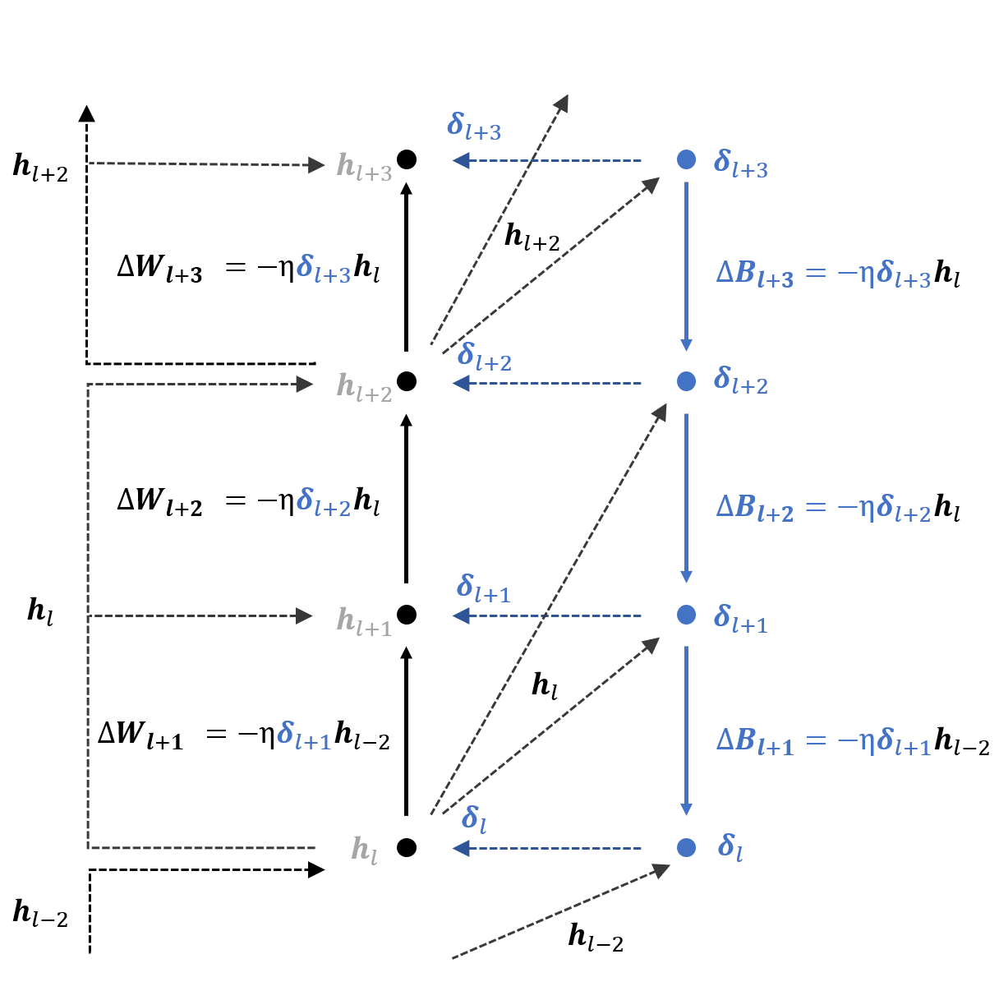

# Activation-Sharing-with-Asymmetric-Paths

This repository is the official implementation of Activation-Sharing-with-Asymmetirc-Paths. 

+ The proposed biologically plausible algorithm supports training deep convolutional networks without the weight transport problem and bidirectional connections
+ The proposed biologically plausible algorithm significantly cand reduce memory access overhead when implemented in hardware.

<p align="center">

## Requirements

To install requirements:

```setup
pip install -r requirements.txt
```

## Training

See help (--h flag) for before executing the code.

\'train.py is provided to train the model.
  
```train
python train.py --dataset <type of dataset> --model <type of model> --feedback <type of feedback> --augmentation
```

## Evaluation

See help (--h flag) for before executing the code.

\'eval.py is provided to evaluate the model.

```eval
python train.py --dataset <type of dataset> --model <type of model> --feedback <type of feedback> --augmentation
```

## Pre-trained Models

You can download pretrained models here:

- [My awesome model](https://drive.google.com/mymodel.pth) trained on MNSIT, SVHN, CIFAR-10, CIFAR-100. 

>📋  Give a link to where/how the pretrained models can be downloaded and how they were trained (if applicable).  Alternatively you can have an additional column in your results table with a link to the models.

## Results

The test accuracy of experiment is as follow;
  
<p align="center">
  
<p align="center">

## Contributing

>📋  Pick a licence and describe how to contribute to your code repository. 
